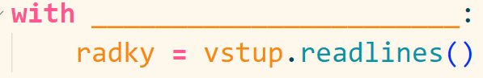

Co je třeba doplnit namísto podtržítek, abychom získali ceny korunách?

Správná odpověď: `[cena * kurz for cena in ceny_v_eurech]`

Doplň program, aby přijímal jako parametr cenu v eurech a vypsal cenu v korunách.

Správná odpověď: `float(sys.argv[1])`

Doplň program, aby přijímal jako více cen v eurech jako parametr, převedl je na ceny v korunách a vypsal jejich součet.

Správná odpověď: `[float(cena) * 24.6 for cena in sys.argv[1:]]`

Která funkce se nám hodí na začátku práce se souborem?

Správná odpověď: `open()`

Co dělá metoda readlines()?

Správná odpověď: přečte všechny řádky souboru a uloží je jako seznam

Doplň program, aby načetl hodnoty v souboru ceny.txt

Správná odpověď: `open('ceny.txt', encoding='utf-8') as vstup`

Co je v proměnné radky?

Správná odpověď: hodnoty ze souboru jako seznam desetinných čísel

Co je potřeba doplnit do programu, aby vypsal průměr hodnot v souboru ceny.txt?

Správná odpověď: `statistics.mean(radky)`

Doplň program tak, aby přijímal název souboru, ze kterého má číst, jako parametr.

Správná odpověď: `nazev_souboru = sys.argv[1]`

"Escape sekvence" pro ukončení (zalomení) řádku je

Správná odpověď: `\n`

Následující řádek otevře soubor pro čtení, nikoli pro zápis.

Správná odpověď: `False`

Další řádek po tom na obrázku

Správná odpověď: musí být odsazený

Doplň program tak, aby vypsal obsah seznamu ceny do souboru ceny.txt

Správná odpověď: `vystup.writelines(ceny)`
